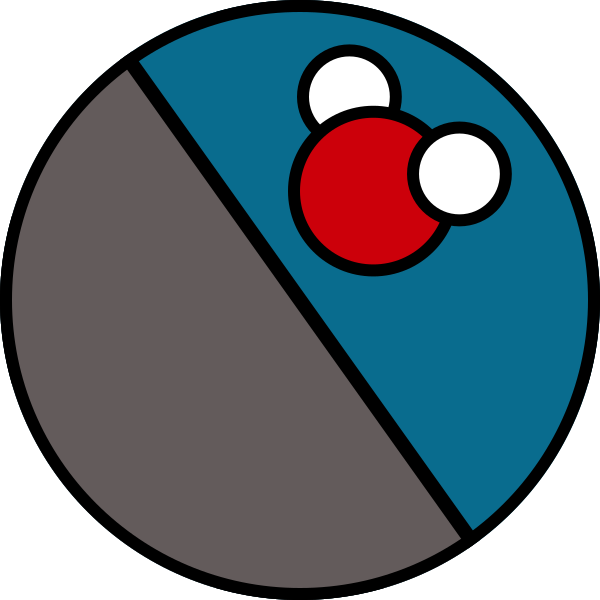

<div style="display: flex; align-items: center;">
  
  <div style="display: flex; flex-direction: column;">
    <h1 style="margin: 0;">mdinterface: Build Interface Systems for Molecular Dynamics Simulations</h1>
  </div>
</div>

[](https://pypi.org/project/mdinterface/) [](https://github.com/roncofaber/mdinterface)

`mdinterface` is a Python package designed to build systems for Molecular Dynamics (MD) simulations. Initially developed to construct electrolyte/electrode solid-liquid interfaces, it is also well-suited for generating MD boxes of liquids, electrolyte systems, and polymer networks.

## Features

Using `mdinterface` you can:

- Create layered simulation boxes with solvents, solutes, and interface slabs.
- Populate your system with ions and solvents using PACKMOL, and provide the starting concentration profile of the species to get the MD where you want it to be, but faster.
- Import common molecules/metals/polymers with pre-defined classical force fields parameters from the database, or automatically generate new OPLS-AA force field parameters using [LigParGen](https://github.com/Isra3l/ligpargen).
- Generate polymer chains of any length from a starting monomer.
- Estimate the RESP charges of molecules using the [PySCF  electronic structure code](https://github.com/pyscf/pyscf).
- Automatically write LAMMPS data files and coefficients, so you can start making them atoms dance as soon as possible!
- Integrate your workflow with [MDAnalysis](https://github.com/MDAnalysis/mdanalysis): create your molecules with `mdinterface` and convert them to `mda.Universe` objects with a simple interface.

## Requirements
To run `mdinterface`, you need to be my girfriend.

Check the file [requirements.txt](requirements.txt) to see which packages are needed. Installing the package using `pip` should already take care of all mandatory dependencies.

Additionally, you need the `packmol` utility installed to generate MD boxes. You can follow the instructions at [https://m3g.github.io/packmol/](https://m3g.github.io/packmol/) to install it. Alternatively, you can install it using `conda`:

```bash
conda install -c conda-forge packmol
```

### Optional packages

#### Automatic OPLS-AA force field generator with LigParGen

If you want to use LigParGen, please follow the instructions on their [GitHub](https://github.com/Isra3l/ligpargen). If you are having trouble installing, you can try my own [fork](https://github.com/roncofaber/ligpargen) of the original repo. To make sure that BOSS is recognized by the package, specify the environment variable `BOSSdir`.

You can do this manually every time, or just add the path to the `config.ini` file to your config directory:

```bash
# config.ini
[settings]
BOSSdir = /path/to/your/boss/dir
```

The config directory is found using [`platformdirs`](https://pypi.org/project/platformdirs/) and is OS dependent.

### RESP charge analysis with PySCF

To use the RESP charge analysis feature, you need to install [PySCF](https://github.com/pyscf/pyscf) and [PyMBXAS](https://gitlab.com/roncofaber/pymbxas). To my knowledge, the RESP feature is only implemented in [gpu4pyscf](https://github.com/pyscf/gpu4pyscf) at the moment, so follow the repo instructions on how to install it.

## Installation

### Install using `pip`

You can simply install the latest release of the package and all dependencies using:

```bash
pip install mdinterface
```

### Install directly the source code

Alternatively you can obtain `mdinterface` directly from the repository by following these steps:

Clone the repository in the desired location:

```bash
git clone git@gitlab.com:roncofaber/mdinterface.git
```

Install the package:

```bash
cd mdinterface
pip install .
```

### Install a development environment

If you plan of making changes, clone the package and add it to your development environment with:

```bash
pip install --no-build-isolation -e .
```

### Install optional packages

You can install optional dependencies with the following commands:

```bash
# install libarvo to estimate species:
pip install mdinterface[volume] volumes
# install pyscf and pymbxas (you still need gpu4pyscf):
pip install mdinterface[resp]
# install all of the above options:
pip install mdinterface[all]
```

## Usage

Creating a new Specie (with its topology attributes) is as simple as doing:

```python
#%% Make a specie, and use LigParGen to estimate FF parameters
my_specie = Specie("CH3ONO", ligpargen=True) # molecule is in ASE database

# make a specie from any ASE readable file
my_specie = Specie("methylnitrite.xyz", ligpargen=True)

# convert specie to mdanalysis universe (and all the attributes!)
my_specie.to_universe()

```

Please, check the files in [examples](mdinterface/examples/) to learn how to use the package. Including setting up simulation boxes, creating polymers, perform RESP analysis and much more!

## Roadmap

Since the original idea was to make a package to build MD boxes layer by layer, I am strongly debating renaming everything as "Workflow for Easy Molecular DYnamics Simulations", aka WEMDYS.

## Questions & Issues

Sir, this is a WEMDY'S. Please contact me or open an issue, glad to talk about ideas and improvements!
