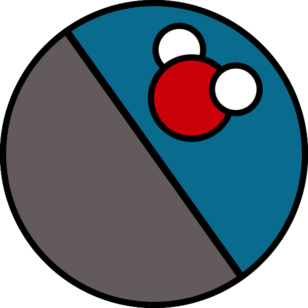

<div style="display: flex; align-items: center;">
  
  <div style="display: flex; flex-direction: column;">
    <h1 style="margin: 0;">mdinterface: Build Interface Systems for Molecular Dynamics Simulations</h1>
  </div>
</div>

[](https://pypi.org/project/mdinterface/) [](https://github.com/roncofaber/mdinterface) [](https://roncofaber.github.io/mdinterface)

`mdinterface` is a Python package for building systems for Molecular Dynamics (MD) simulations. Initially developed for electrolyte/electrode solid-liquid interfaces, it is equally suited for pure solvent boxes, mixed-solvent electrolytes, and polymer networks.

## Features

- **Layer-by-layer `SimCell` builder**: add slabs, solvent regions, and vacuum gaps one step at a time; call `.build()` when done.
- **ASE & MDAnalysis integration**: the assembled box converts to `ase.Atoms` or `mda.Universe` with a single call, ready for any downstream tool.
- **Multi-solvent support**: mix solvents by molar ratio + density, ratio + total count, or explicit per-species molecule counts.
- **Ion placement**: dissolve ions by count, molar concentration, or a spatially-varying concentration profile.
- **PACKMOL integration**: handles molecular packing automatically; tolerance and dilation are tunable per layer.
- **Configurable stacking axis**: build along Z (default) and permute to X or Y at the end.
- **Polymer builder**: generate chains of arbitrary length from a monomer `Specie`.
- **AIMD with FAIRChem**: run ML-potential dynamics via FAIRChem (optional).
- **RESP charges**: estimate partial charges with PySCF / gpu4pyscf (optional).
- **Force-field database**: pre-defined parameters for common metals, noble gases, water models, and ions; or generate OPLS-AA parameters on the fly with LigParGen.
- **LAMMPS output**: writes data files and force-field coefficient blocks ready to run.

## Requirements

Check [requirements.txt](requirements.txt) for mandatory dependencies. `pip install mdinterface` handles them automatically.

You also need `packmol` installed and on your `PATH`:

```bash
conda install -c conda-forge packmol
```

### Optional packages

#### LigParGen (automatic OPLS-AA parameters)

Follow the instructions on the [LigParGen GitHub](https://github.com/Isra3l/ligpargen) (or try [this fork](https://github.com/roncofaber/ligpargen) if you hit installation issues). Point `mdinterface` to your BOSS directory via `config.ini`:

```ini
# ~/.config/mdinterface/config.ini  (path is OS-dependent)
[settings]
BOSSdir = /path/to/boss
```

#### RESP charges with PySCF

Install [PySCF](https://github.com/pyscf/pyscf) and [PyMBXAS](https://gitlab.com/roncofaber/pymbxas). RESP fitting currently requires [gpu4pyscf](https://github.com/pyscf/gpu4pyscf).

#### AIMD with FAIRChem

```bash
pip install fairchem-core
```

## Installation

- **Python** 3.8+
- **PACKMOL** (see above)

```bash
# Stable release
pip install mdinterface

# Development version
git clone https://github.com/roncofaber/mdinterface.git
cd mdinterface
pip install -e .
```

Optional extras:

```bash
pip install mdinterface[resp]   # RESP charge analysis
pip install mdinterface[aimd]   # FAIRChem AIMD
pip install mdinterface[all]    # everything
```

## Quick start

```python
from mdinterface import SimCell
from mdinterface.database import Water, Metal111

water = Water()
gold  = Metal111("Au")

simbox = SimCell(xysize=[15, 15])
simbox.add_slab(gold, nlayers=3)
simbox.add_solvent(water, zdim=20, density=1.0)
simbox.build()

atoms = simbox.to_ase()    # ase.Atoms — ready for AIMD, ML-MD, or any other tool
```

For LAMMPS, add ions and call `write_lammps()` instead:

```python
from mdinterface.database import Ion

na = Ion("Na", ffield="Cheatham")
cl = Ion("Cl", ffield="Cheatham")

simbox = SimCell(xysize=[15, 15], verbose=True)
simbox.add_slab(gold, nlayers=3)
simbox.add_solvent(water, solute=[na, cl], nsolute=[5, 5], zdim=25, density=1.0)
simbox.add_slab(gold, nlayers=3)
simbox.build(padding=0.5)
simbox.write_lammps("data.lammps", atom_style="full", write_coeff=True)
```

More complete scripts are in the [examples/](examples/) directory:

| Script | What it shows |
|--------|--------------|
| `electrode_interface.py` | Au / NaCl electrolyte / Au sandwich |
| `solvent_box.py` | Pure solvent + dissolved species |
| `multisolvent_box.py` | Mixed-solvent box with ratio/density/count modes |
| `multilayer.py` | Five-layer multi-slab system |
| `sandwich_from_traj.py` | Electrode / membrane / electrode sandwich from an equilibrated MD trajectory |
| `polymer/polymer_piperion.py` | Co-polymer membrane box with explicit hydration number |

Full API reference and user guide: [roncofaber.github.io/mdinterface](https://roncofaber.github.io/mdinterface)

The legacy `SimulationBox` API is still available and unchanged; see [examples/legacy/](examples/legacy/).

## Roadmap

Since the original idea was to make a package to build MD boxes layer by layer, I am strongly debating renaming everything as "Workflow for Easy Molecular DYnamics Simulations", aka WEMDYS.

## Questions & Issues

Sir, this is a WEMDY'S. Please contact me or open an issue, glad to talk about ideas and improvements!
